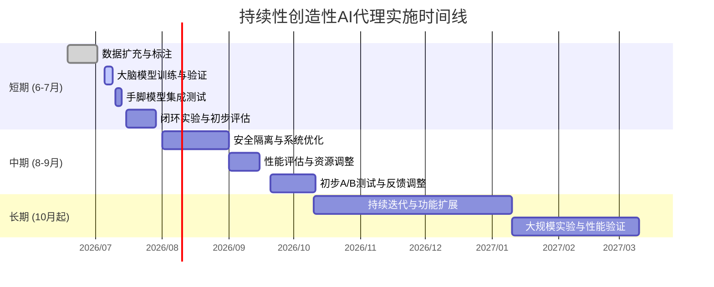

# 持续性创造性AI代理计划可行性评估报告

## 执行摘要

本计划旨在构建一个持续学习、自主探索的AI代理，其“大脑+手脚”架构通过小模型负责决策并选择有限意图（20类），大模型（Qwen 2.5 1.5B）负责将意图转换为精确的操作命令。该设计符合近期**以小模型为主导的多模型系统**思路：Belcak 等（2025）指出，大多数代理任务重复性高、范围有限，1B–10B参数的模型能匹配老一代大模型性能，且推理成本和延迟低10–30倍。然而，该架构也存在挑战：小模型容量仅46M，样本仅100余/类，可能难以学习所有任务特征，存在欠拟合风险；世界模型推理真实动态的能力有限，而文献表明LLM在特定结构化环境下预测精确结果很困难，更遑论极小模型；另一方面，执行者LLM可能生成错误或不存在的指令（“行动幻觉”风险），严重时可导致系统故障。因此，我们认为该方案**创新可行**但**存在显著风险**。建议优先扩充标注数据和引入自动生成策略，同时强化世界模型（或引入更复杂探索算法）和环境隔离措施。预计短期内可完成数据准备、模型训练和闭环测试，中长期需根据实验结果迭代优化架构；下文分析详尽论证了技术可行性、数据及合规性、成本与扩展性、安全隐患，并给出具体建议、优先级和实施步骤（见后附时间表和比较表格）。

## 1. 项目目标与工作流程

- **核心目标**：从零开始构建一个无需人工干预、可持续“创造性”学习的AI代理，在Docker沙箱中自主探索，行为多样且持续进化。强调“思维=概率+最优选择”的假设，通过连续反馈循环提升决策。
- **系统流程**：每一步代理通过“大脑”（ModelCluster v3小模型，46M参数）选择一个意图（共20种），再由“手脚”（Qwen 2.5 1.5B模型，通过Ollama推理）将意图映射为具体的Bash命令执行。执行结果（命令输出）反馈给“大脑”，用于**世界模型**预测和信心评估：若预测误差高，则触发“好奇心模式”进行新的探索，如尝试未知命令或参数；否则继续常规策略。如此闭环循环下，代理不断丰富对环境的理解和知识。

## 2. 技术架构与模型选择评估

- **架构优势**：该“大脑+手脚”方案将规划与执行分离，符合层次化智能系统思想。类似自动驾驶领域中“决策器+执行器”的分层结构，即由高层策略模型生成元决策，由专门模型执行细粒度控制。采用**小模型处理固定意图**、**大模型执行命令**的设计符合近期趋势：Belcak 等指出，多数代理任务“重复且范围有限”，1B-10B参数的小模型可提供足够能力，且推理成本和延迟远低于超大模型。本方案中，小模型仅46M，可在常规CPU环境中快速推理（单步推理<5ms），占用资源极小；大模型1.5B参数，若配合量化可在几GB内存下运行（Qwen2.5-1.5B在高端CPU上约20 tokens/s）。总体资源占用较低，初步训练耗时可控制在数小时级。

- **模型选择评估**：  
  - *大脑（意图与世界模型）*：目前训练目标是20类意图分类（softmax输出）及输出预测。20类×100样本的规模对于46M参数网络可能较小，容易发生欠拟合。世界模型（预测执行输出）难度更高：文献表明，LLM在结构化、特定领域环境下生成精确预测具有挑战；本方案的小模型更缺乏知识储备，可能难以准确模拟系统行为。此外，小模型的决策范围限定于预定义意图集，新意图或环境变化可能导致决策失效。  
  - *手脚（大模型执行）*：Qwen 1.5B是目前最小的可用候选，大多数开发者使用GPU部署。该项目尝试CPU推理，但实测速度约为每秒20余token，若任务需频繁高吞吐可能成为瓶颈。相比之下，使用云端LLM（如GPT-3.5/GPT-4）则成本高且受限网络，单一大模型方案具备更强常识和推理能力，但在本地部署难度大、实时性差。小模型+专用大模型的混合方案在成本和灵活性上更优，但牺牲了部分通用能力和训练简易性。

- **可行性与风险**：  
  - *数据不足问题*：当前意图标注数据仅千级，远低于对复杂任务通常需用数万甚至数十万样本才能收敛的规模。若模型容量较小且数据单一，容易出现过拟合和泛化不足，导致意图分类和世界模型表现不稳。  
  - *错判与误执行*：若大脑误选意图或预测错误，可能触发错误命令。AgentNet文献指出“行动幻觉”最为致命：比如误删文件、调用不存在接口等。虽然计划环境为沙箱，仍需防护机制（如命令验证）。  
  - *闭环稳定性*：世界模型误差被用作好奇心信号，一旦持续偏差或环境复杂性超出预测能力，可能导致代理陷入反复探索或误判新领域。相关工作WorldLLM通过RL探索稀有转变来改善模型，本方案尚缺乏自适应机制，这或致学习效率低下。  
  - *其他考虑*：需要关注模型偏见和安全问题（如文本注入），以及上下文管理（保持状态）等领域挑战。

## 3. 数据来源与标注流程

- **现状**：使用了“clean-v3”数据集（约1452条记录）作为基础样本，并计划扩展到2000+条。阶段1手动完成意图标注，结合脚本`intent_translator.py`辅助转换。  
- **数据质量风险**：千级样本的多样性有限，易导致偏差和欠拟合。例如，每类意图平均仅几十条正例，可能无法覆盖命令参数的丰富组合。若标注不够精确或不全面，训练的大脑模型将难泛化。  
- **改进建议**：建议采用自动化或半自动化方法生成额外数据，如利用大语言模型（LLM）扩增问句与命令组合（数据增强）。同时强化验证流程，对自动生成的标注需人工审查。标注流程应融入“在线学习”：代理实际执行新命令并记录结果，动态汇入训练集中，以持续改进大脑模型（类似闭环强化学习）。确保数据集遵循软件和数据版权许可（命令输出通常为系统信息，不含受版权保护内容）。

## 4. 知识产权和合规风险

- **模型与代码许可**：所用大模型（Qwen2.5 系列）均在HuggingFace以Apache-2.0许可协议发布，允许商用和修改，无额外版权限制。操作系统命令（如`ls`, `cat`等）及常见工具通常处于公开许可或BSD/GPL下，短时读取输出用于内部学习一般不构成侵权。  
- **数据合规**：代理从沙箱环境读取的信息主要为系统元数据和测试文件内容，不涉及个人隐私或敏感数据，合规风险较低。但须注意：若环境中加载了业务或用户数据（如API密钥、私有仓库），需要严格隔离，防止泄露。应遵循最佳实践：禁止写出/读取沙箱外部文件和网络访问。  
- **版权风险**：输出文本如果包含受版权保护信息（例如项目文档），则需考虑合理使用范围。本项目目标主要为探索基础系统，暂未明确对外发布成果，但若后续商用，需审查所有第三方依赖的许可证（Qwen已开源，若使用其他模型或工具，确认其授权）。

## 5. 运营成本、扩展性与安全隐患

- **计算与成本**：大脑部分成本极低：46M模型在普通CPU上训练单轮约30分钟，推理微秒级（几十ms内），无需GPU，可用一般云主机或边缘设备承载。手脚部分则较重：Qwen-1.5B若在CPU推理速度约20tps，如需实时响应或大量探索，可能需借助GPU/TPU以满足性能需求。对比商业API服务，使用开源模型可降低运行费用，但初期需购买或配置合适硬件。总体来说，初始部署成本主要来自于服务器基础设施和后续算力升级，模型本身许可无额外费用。  
- **扩展性**：当前架构仅覆盖固定20类意图。若未来扩展新领域或更复杂任务，需新增意图、调整大脑结构或引入更多子模型。这将增加数据采集和再训练工作量。系统扩展可采用模块化策略：新增意图只需收集样本并微调大脑；增加新技能可能引入新的“手脚”模型。架构理论上可横向扩展多模型（Belcak等建议代理可调用多种不同规模模型）。运维方面，应设计监控系统资源使用（CPU/GPU利用率）和模型性能（响应延迟、正确率）来评估扩展需求。  
- **安全隐患**：执行命令带来多种风险。依据NVIDIA安全指导，需实施以下强制措施：**阻止网络出口**（禁止环境访问外部网络，防止数据外泄和远程控制）；**限制文件系统操作**（禁止写入工作区外文件和配置文件，防止持久化恶意代码）；**虚拟化隔离**（通过虚拟机或容器隔离宿主系统，严防逃逸）。此外，应对LLM输出建立校验机制，例如仅允许从预定义意图映射到命令模板，从而避免模型自拟未授权行为。  
- **监控与维护**：建议实现监控和日志系统：记录每次操作输入输出、模型决策和预测误差，用以及时发现异常模式和性能瓶颈。代理长期运行中，应定期验证世界模型准确率和意图识别正确率，并更新模型以避免技术陈旧或数据漂移。安全审计（审查生成的命令）也是必要的长期维护环节。

## 6. 关键绩效指标与试验方案

**绩效指标（KPI）**：  
- **探索效果**：累计发现的新知识/新命令或触发好奇心的次数。可以用不同时间窗口内“高误差→新命令尝试”事件计数表示系统探索能力。  
- **预测精度**：世界模型的平均预测误差（均方误差或对数似然）。误差下降趋势可衡量学习进展。  
- **操作成功率**：执行计划命令后得到合理输出的比例。若大脑/手脚误判概率高，应体现于此。  
- **效率指标**：例如平均每步决策时间、资源利用率（CPU/GPU负载、内存使用）。这些反映系统实时性和成本。  
- **稳定性指标**：循环次数增长、循环失败次数（代理重复无进展行为）等，用于监控是否陷入无效循环或僵局。

**A/B测试与实验**：  
可设计对比实验验证架构效果。建议的对照组包括：  
- **无脑大模型方案（baseline）**：直接用单一LLM完成意图选择与命令生成，不依赖小模型决策。比较两者在执行效率、正确率和资源消耗上的差异。  
- **有脑不同模型配置**：如用更大（或更小）脑模型，或替换不同规模的手脚模型，评估模型规模对性能的影响。  
- **强化/非强化学习流程**：尝试插入RL策略（如WorldLLM方法）与原始好奇算法对比，查看哪种策略更快完善世界模型。  

每组实验均应多次重复，在相同环境下进行（如随机种子控制、相同初始状态），以统计显著性评估差异。通过以上实验，可以量化「脑+手脚」方案是否真正提高了探索深度和执行稳定性，以及投入资源和时间是否带来实际收益。

## 7. 替代方案比较

| 方案             | 模型架构                    | 推理硬件  | 优点                                     | 缺点                                 |
|----------------|---------------------------|---------|----------------------------------------|--------------------------------------|
| 单一LLM      | 100B级通用大模型（云API）| 高端云GPU | 通用能力强，对话和规划一体化               | 成本极高，延迟大，依赖网络，扩展性差        |
| SLM+LLM (当前) | 46M意图分类模型 + 1.5B执行模型 | CPU+小GPU | 成本低、模块化强，响应迅速；可本地部署，不易泄密 | 大脑容量受限、需要协调两个模型；执行模型推理慢 |
| 分层强化学习   | 多层神经网络（策略+执行）     | 多GPU    | 长期规划能力较强，可端到端优化             | 架构复杂，训练难度大，需要大量交互数据      |

| 模型              | 参数量    | 硬件需求    | 推理速度（大致）         | 应用场景与备注                        |
|-----------------|---------|------------|-----------------------|--------------------------------------|
| Qwen2.5-1.5B    | 1.5B    | CPU/GPU    | ~20 token/s（CPU，见） | 开源免费，适合代码生成和命令解释      |
| GPT-3.5（gpt-3.5-turbo） | ~175B  | 云端API    | 实时（云端GPU）         | 收费，高对话质量，适合通用对话           |
| 本地SLM（大脑用）  | ~46M    | CPU        | <5ms/次（单步预测）    | 本方案意图分类专用模型，训练快、成本低    |

## 8. 改进建议与实施计划

根据以上评估和风险分析，提出以下**优先级排序**的建议与实施步骤：

1. **扩充和自动化数据集**（努力：中等；成本：低）：当前标注数据规模有限，建议使用LLM自动生成更多多样的命令-意图样本，并人工审核。同时在代理运行中记录新的交互示例，定期加入训练集中，实现在线增量学习。这一步可显著提升模型泛化能力。
2. **强化大脑世界模型**（努力：高；成本：中等）：考虑提升大脑模型容量或引入增量学习结构，如记忆网络或LSTM，以更好模拟环境动态。可探索使用如WorldLLM中提到的**RL+LLM理论引导**方法，让代理主动探索难以预测的转变。若资源允许，可升级至较大SLM以增强表示能力。
3. **安全隔离和监控**（努力：中等；成本：中等）：严格落实沙箱控制策略，确保代理在受限环境中执行。实现操作日志记录和命令输出过滤，避免意外写入或读取。对所有外部交互（文件、网络）要求人工审批或预设白名单。
4. **评估与调参**（努力：持续；成本：低）：在每阶段迭代后执行A/B测试（见第6节）评估模型调整效果。监控KPIs趋势（预测误差、成功率等），据此动态调整模型超参或架构。若发现训练瓶颈，可考虑使用GPU加速或更大模型。
5. **功能扩展与迭代**（努力：长期；成本：未知）：依据项目目标，可考虑逐步开放新的意图类别、支持多轮对话或多模态输入等功能。每一扩展都应重新进行安全和版权审查，并根据实际效果重新评估ROI。

## 9. 项目实施时间线

**备注**：时间线为粗略估计，具体以项目开展情况为准。 

以上各步骤、建议和时间规划将帮助落实项目目标，同时降低技术和运营风险，逐步推动原型系统向稳健、可扩展的方向演进。

**参考文献**：本文所有技术论断和建议均参考最新研究和业界实践等。各引用来源详细见上文对应标注。