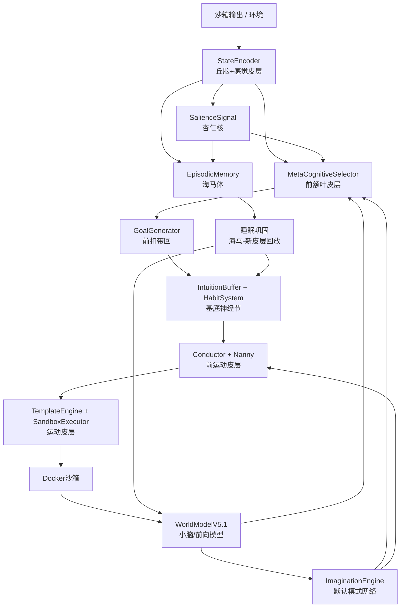

# Folunar_ Brain-Reference Architecture

> 人脑参考架构: 将 P10-P19 的 agent 模块映射到大脑功能区, 使 P20 之后的扩展有明确的神经科学对照。
> 最后更新: 2026-07-01

## Why this mapping matters

The Folunar_ agent was built layer by layer (P10 hierarchy, P11 persistence, P12 knowledge expansion, P13 tools, P14 LLM pipeline, P15 brain-inspired dynamics, P16 reasoning, P17 self-awareness, P18/P19 world-model and imagination). By P19 the system had several modules that were already brain-like in function, but the analogies were scattered in comments. P20 makes the mapping explicit so that:

- New mechanisms have a clear location in the architecture (e.g., "this belongs to the hippocampal-neocortical loop").
- Missing biological functions become feature gaps (e.g., "we have no amygdala, so salience is ad-hoc").
- The main loop behaves more like a coordinated brain network than a bag of submodules.

This document is a living reference: when a module is added or removed, its brain-region entry should be updated.

## Global signal flow

Three global loops are explicit in the code:

1. **Perception-action loop**: StateEncoder → MetaCognitiveSelector → GoalGenerator → IntuitionBuffer/HabitSystem → Conductor/Nanny → SandboxExecutor → WorldModelV5.1 → back to MetaCognitiveSelector.
2. **Salience loop**: SalienceSignal (amygdala) modulates StateEncoder attention, EpisodicMemory encoding, and MetaCognitiveSelector MODE switching.
3. **Consolidation loop**: EpisodicMemory → sleep consolidation → updates WorldModelV5.1 and IntuitionBuffer/HabitSystem, mirroring hippocampal-neocortical replay during sleep.

## Module-to-region mapping

| Module | Brain region / function | Role in the agent | Current status | P20 change |
|--------|------------------------|-------------------|----------------|------------|
| `MetaCognitiveSelector` | Prefrontal cortex (PFC) | Executive control: picks MODE (EXPLORE/CREATE/LEARN) | Implemented | Uses salience signal for faster MODE switching |
| `StateEncoder` | Thalamus + sensory cortex | Attentional gating of FactGraph inputs into a state text | Implemented | Added `salience_hints` to boost high-salience facts |
| `Conductor` + `Nanny` | Premotor cortex | Translates high-level thought into concrete intent and parameters | Implemented | No direct P20 change |
| `TemplateEngine` + `SandboxExecutor` | Motor cortex | Executes the final command in the sandbox | Implemented | No direct P20 change |
| `RND` | Amygdala / novelty detector | Detects novel states and drives exploration | Implemented | Output feeds into `SalienceSignal` instead of being used directly |
| `SalienceSignal` (new) | Amygdala / global salience | Combines novelty, WM surprise, success, and reward into a single signal | New in P20 | Created as `agent/salience.py` |
| `EpisodicMemory` | Hippocampus | Stores surprise-based events for replay | Implemented | Encoding gated by salience signal |
| `IntuitionBuffer` | Basal ganglia / procedural memory | Stores successful intent-state embeddings for fast retrieval | Implemented | Now part of the habit loop |
| `HabitSystem` (new) | Basal ganglia / habit formation | When an intent-action pair is reliably successful, bypass deliberation | New in P20 | Created as `agent/habit.py` |
| `WorldModelV5.1` | Cerebellum / forward model | Predicts next state embedding and surprise from action | Implemented | Predictions feed salience signal |
| `ImaginationEngine` | Default mode network (DMN) | Internally generated rollouts when external input is low | Implemented | Triggered by low mean salience / boredom |
| `GoalGenerator` | Anterior cingulate cortex (ACC) | Conflict monitoring, goal selection, hypothesis testing | Implemented | No direct P20 change |
| `CreativeWriter` | Broca's area / language production | LLM-based text generation for reports and self-reflection | Implemented | No direct P20 change |
| `SelfModel` | Medial prefrontal cortex / self-representation | Tracks intent success rates, highlights, and self-description | Implemented | No direct P20 change |
| `TransitionMiner` + `HypothesisEngine` + `ExperimentPlanner` + `Verdict` | Scientific reasoning network | Causal discovery, hypothesis generation, experiment design, belief update | Implemented | No direct P20 change |

## Detailed region notes

### Prefrontal cortex: `MetaCognitiveSelector`

- **What it does**: Chooses the global MODE (EXPLORE/CREATE/LEARN) based on state embedding, confidence, and fact coverage.
- **Brain analogy**: The dorsolateral prefrontal cortex selects task sets and switches between them.
- **P20 change**: The selector now receives a `salience` scalar. High salience (>0.5) can trigger an earlier MODE switch from CREATE back to EXPLORE or from EXPLORE to LEARN if the world model is uncertain.

### Thalamus + sensory cortex: `StateEncoder`

- **What it does**: Converts the raw FactGraph and last command output into a compact state text for the classifier, Conductor, and embedding models.
- **Brain analogy**: The thalamus gates sensory input to the cortex; attention determines what reaches conscious processing.
- **P20 change**: `_get_dynamic_facts` accepts `salience_hints`. High-salience facts are boosted by `(1.0 + salience)`, low-salience facts are demoted by `0.5`. This is the formal thalamic gate.

### Amygdala: `SalienceSignal`

- **What it does**: Computes a single scalar from RND novelty, WM surprise, last-step success, and last-step reward.
- **Brain analogy**: The amygdala tags events as salient (threat, opportunity, novelty) and modulates attention and memory consolidation.
- **P20 change**: New module. It does not learn; it is a weighted combination with a running window. This keeps it cheap and interpretable on CPU.

### Hippocampus: `EpisodicMemory`

- **What it does**: Stores high-surprise events in a ring buffer for later replay and consolidation.
- **Brain analogy**: The hippocampus encodes episodic memories, especially surprising ones, and replays them during sleep.
- **P20 change**: Encoding threshold is now also influenced by salience. A highly salient event is more likely to be stored.

### Basal ganglia: `IntuitionBuffer` + `HabitSystem`

- **What it does**: `IntuitionBuffer` retrieves past successful actions by vector similarity. `HabitSystem` tracks intent-level success rates and, when confidence is high enough, suggests the same parameters without deliberation.
- **Brain analogy**: The basal ganglia mediate habit formation (dorsolateral striatum) and procedural memory. A habit is a chunked action sequence that can run without cortical oversight.
- **P20 change**: `HabitSystem` is new. It provides fast parameter reuse for reliable intent-action pairs, complementary to the similarity-based retrieval of `IntuitionBuffer`.

### Cerebellum / forward model: `WorldModelV5.1`

- **What it does**: Predicts the next state embedding from the current state and action, and produces a surprise signal via KL divergence on the stochastic latent state.
- **Brain analogy**: The cerebellum maintains internal forward models that predict the sensory consequences of motor commands; prediction errors drive learning.
- **P20 change**: The WM surprise signal is now fed into `SalienceSignal` instead of being used only for training.

### Default mode network: `ImaginationEngine`

- **What it does**: Generates internal rollouts of possible future states when the agent is bored or external input is low.
- **Brain analogy**: The DMN is active during rest and internally directed thought (mind-wandering, future simulation).
- **P20 change**: Boredom is now driven by low mean salience over a window, formalizing the "low external input → internal simulation" dynamic.

### Anterior cingulate: `GoalGenerator`

- **What it does**: Generates candidate goals (gaps, curiosity, creativity, hypothesis tests) and scores them.
- **Brain analogy**: The anterior cingulate cortex monitors conflict and error likelihood, biasing goal selection.
- **P20 change**: None directly. The salience signal may be used in future phases to bias gap-vs-curiosity selection.

## What is still missing (future work)

These are natural extensions that the mapping makes visible:

- **Locus coeruleus / norepinephrine**: A global arousal signal that modulates learning rate. Currently learning rates are fixed.
- **Dopamine reward prediction error**: The reward signal is adaptive but not explicitly a prediction error. Could connect WM prediction error to reward shaping.
- **Hippocampal replay scheduling**: Sleep consolidation is periodic. Future work could make it event-driven by high salience.
- **Cortical columns / ensemble coding**: The classifier and Conductor are single networks. Future work could use ensembles for uncertainty estimation.
- **Inter-hemispheric competition**: No explicit exploration-exploitation arbitration layer beyond the MODE selector.

## Design constraints carried forward

- **No trainable salience network in P20**: The amygdala analog is kept as a simple weighted combination to avoid adding a new model that needs training data on CPU.
- **Backward-compatible StateEncoder**: Callers without `salience_hints` continue to work unchanged.
- **Habit keying starts simple**: Intent-only keys are conservative; if wrong habits form, the keying will be refined to `(intent, normalized_template)` in a follow-up.
- **LEARN mode bypasses habits**: Hypothesis testing should not be short-circuited by habits.

## References

- `ARCH_REVIEW_P10_EVOLUTION.md` — earlier "dynamic layers like human brain network" discussion
- `PLAN_BRAIN_HAND.md` — "brain + hands/feet" architecture proposal
- `PLAN_P18_WORLD_MODEL_V5.md` — world-model forward-model motivation
- `agent/meta_selector.py` — existing prefrontal-cortex analogy
- `agent/episodic_memory.py` — existing hippocampus analogy
